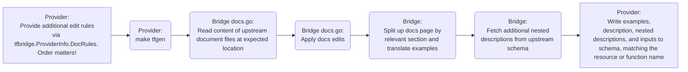
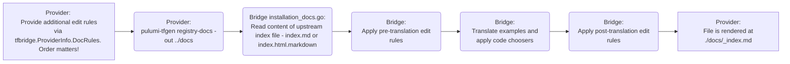

# Editing Registry Docs

The Pulumi-Terraform Bridge converts Terraform providers into Pulumi providers. 
As such, the documentation for each so bridged provider is _also_ generated and converted from the upstream Terraform provider.
What this means is that in order for a registry docs page to be changed, the ideal way to do so is to edit the upstream file into a state that the bridge "expects".
However, since Pulumi does not own those upstream repositories, such changes are difficult and slow, and we have devised some workarounds.
In this document, we attempt to show the use of the most common of these workarounds.

> [!NOTE]
> *For community contributors*
> 
> While this document is mostly aimed at bridge maintainers, we do hope that this sheds some light on our docsgen process, and may empower you to attempt a docs fix in the future.
> But perhaps this will also serve to explain why from a maintainer burden perspective it is never "just" a simple typo fix.

## Process

> [!NOTE]
> It is assumed that the reader of this document is familiar with the provider build and development process, of which the following is a small part.

For resource and function pages, the bridge converts docs, adds extra information from the Terraform schema field, and reads the result into the Pulumi provider schema.
The registry docsgen tool will then later use this information to generate docs pages.



For the provider's top-level registry landing page, there is a slightly separate process that writes to a top-level `docs/` folder instead.
The registry will render this file directly, without registry docsgen.



## Edit Rules

The bridge provides a workaround functionality, `tfbridge.ProviderInfo.DocRules` to allow us to correct registry documentation. 

```go
prov := tfbridge.ProviderInfo{
	# ...
	DocRules:    &tfbridge.DocRuleInfo{EditRules: docEditRules},
}
```
This is useful in cases where a resource page is frequently visited but incorrect or broken.
In order to use edit rules effectively, it is important to remember that they are applied to the upstream docs file pre-docsgen processing in the bridge, as outlined in the process diagrams.

Example using regex replace in a file called `upstream_resourcedoc.md`:

```go
// Regexp for asciicast video link
var videoRegexp = regexp.MustCompile(`\[!\[asciicast\]\(http.*`)
// Removes an asciinema video link
var stripVideo = tfbridge.DocsEdit{
    Path: "upstream_resourcedoc.md",
    Edit: func(_ string, content []byte) ([]byte, error) {
        content = videoRegexp.ReplaceAll(content, nil)
        return content, nil
    },
}
```

You can use a simple string or byte replace as well. 
In this example, the `*` ensures this edit is applied to all doc files:

```go
var removeBadText = tfbridge.DocsEdit{
    Path: "*",
    Edit: func(_ string, content []byte) ([]byte, error) {
    return bytes.ReplaceAll(content, []byte("Bad Word"), []byte("Good Word")), nil
    },
}
```

Here's an example of a large find/replace that reads from files fo find and set text.
It is recommended that if you must do this, you include a hard error so that we don't wind up with orphaned code that finds nothing.
> [!NOTE]
> Large find/replaces are discouraged and should only be used for critical files, such as the `_index.md` landing page, or frequently visited resource pages.
```go
var cleanUpOverviewSection = tfbridge.DocsEdit{
    Path: "index.md",
    Edit: func(_ string, content []byte) ([]byte, error) {
        replacesDir := "docs/index-md-replaces/" // if editing `docs/_index.md`, keep replacements in the same folder by convention
        input, err := os.ReadFile(replacesDir + "overview-input.md")
        if err != nil {
			return nil, err
        }
        if bytes.Contains(content, input) {
            content = bytes.ReplaceAll(
                content,
                input,
                nil)
        } else {
            // Hard error to ensure we keep this content up to date
            return nil, fmt.Errorf("could not find text in upstream index.md, "+
                "please verify file content at %s\n*****\n%s\n*****\n", replacesDir+"overview-input.md", string(input))
        }
        return content, nil
    },
}
```

### Edit Rule Order

Edit Rules are applied *sequentially*, first to last, within their phase. This can result in unintuitive changes!
Example:
1. Start with a file
```markdown
My cat is cute and cuddly
```
2. Apply a rule that changes "cat" to "fluffy dog"
3. The file now reads
```markdown
My dog is cute and cuddly
```
4. Try to apply a rule that changes "My cat is cute and cuddly" to "My pot-bellied pig is cute and cuddly"
5. It won't work:
```markdown
My dog is cute and cuddly
```
This seems simple enough but the bridge makes default docs edits on all providers, so your find/replace may not work as anticipated.
Read on to learn more.

### Default Edits

Right after receiving an upstream docs file, the bridge applies default edit rules to the file.
They can be found [here](../pkg/tfgen/edit_rules.go).
You can make the provider run provider-supplied edit rules first.
This is useful for when your rule may conflict with the bridge's default edit rules.

Example running custom rules before default rules:

```go
func docEditRules(defaults []tfbridge.DocsEdit) []tfbridge.DocsEdit {
	edits := []tfbridge.DocsEdit{
		removeNotes,
		fixExample,
	}
	return append(
		edits,
		defaults...,
	)
}
```

### Edit Phase

When edit rules get applied, they are applied by phase. 
Phases allow us to group certain rules so they can be applied at different times in the docs conversion pipeline.
Currently, `EditPhase`s are only in use for the `docs/_index.md` page generation. 
The default `EditPhase` is `PreCodeTranslation` and no specification is necessary.


