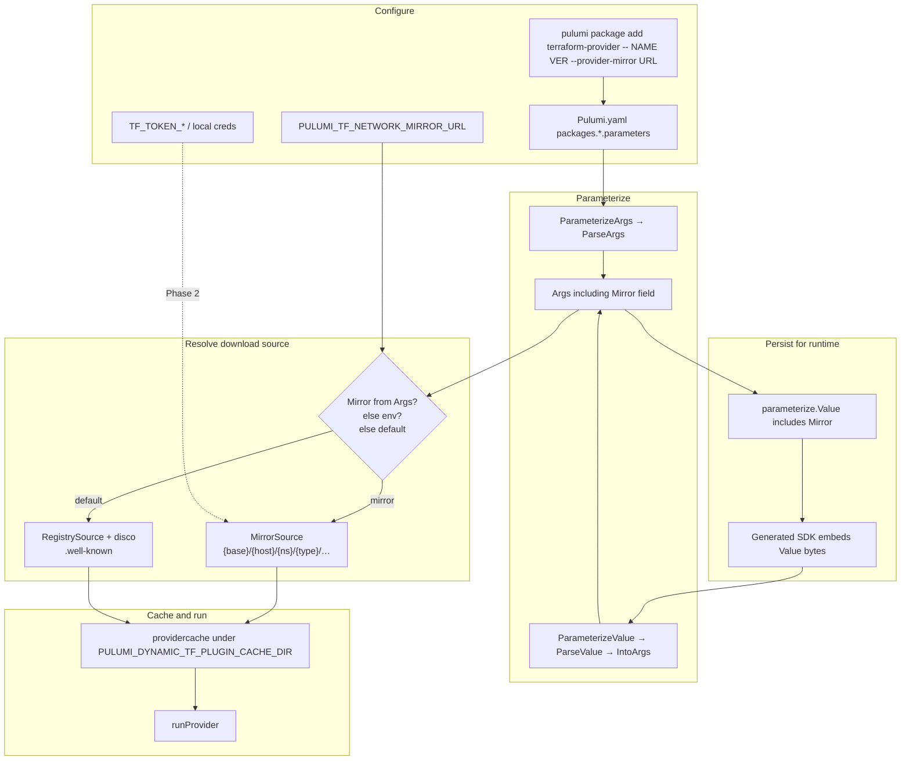

# Network Mirror Support for Dynamic Terraform Providers

**Status:** Draft for review  
**Date:** 2026-07-23  
**Authors:** Discussion on PR [#3463](https://github.com/pulumi/pulumi-terraform-bridge/pull/3463), issues [#3334](https://github.com/pulumi/pulumi-terraform-bridge/issues/3334) and [pulumi-terraform-provider#106](https://github.com/pulumi/pulumi-terraform-provider/issues/106)  
**Scope:** Dynamic `terraform-provider` path in `pulumi-terraform-bridge`  
**Audience:** Maintainers and contributors reviewing design before / during implementation

---

## 1. Executive summary

Air-gapped and enterprise environments often cannot reach public Terraform or OpenTofu registries. Those environments already use the [Provider Network Mirror Protocol](https://developer.hashicorp.com/terraform/internals/provider-network-mirror-protocol) (also documented by [OpenTofu](https://opentofu.org/docs/internals/provider-network-mirror-protocol/)) via `.terraformrc` / `.tofurc` `provider_installation` blocks.

Pulumi’s dynamic `terraform-provider` currently resolves and downloads upstream Terraform providers through registry service discovery (`.well-known/terraform.json`). That call fails when the public registry is unreachable, even when a working network mirror exists.

This document defines a **target architecture** and a **phased plan** to support network mirrors:

| Phase | Capability | Primary outcome |
|-------|------------|-----------------|
| **0** | `PULUMI_TF_NETWORK_MIRROR_URL` | Unblock air-gapped installs via env (PR #3463) |
| **1** | `--provider-mirror` + persist in `Value` + D10 same-host skip | Durable per-package config; closes #3334 |
| **2** | Auth: `TF_TOKEN_*` + optional Pulumi credentials store | Authenticated mirrors without secrets in yaml |
| **3** | Host/pattern routing (TF `include`/`exclude` parity via Pulumi-native overrides) | Same outcomes as `.terraformrc` `provider_installation` |
| **4** | Optional: `filesystem_mirror`, hash verify polish | Only if demand |

**Config philosophy:** achieve **behavioral parity** with Terraform `provider_installation` / `network_mirror`, using **Pulumi-native** surfaces (env, package parameters, `~/.pulumi/credentials.json`). **Do not parse** `.terraformrc` / `.tofurc` (see §22).

**Recommended approach:** ship Phase 0, then Phase 1. Phases 2–3 deliver enterprise parity. Phase 4 uncommitted.

For works/doesn't catalog see **§8A**. For Terraform → Pulumi mapping examples see **§22**.

---

## 2. Problem statement

### 2.1 What fails today

When a user runs:

```bash
pulumi package add terraform-provider hashicorp/random
# or later:
pulumi install
pulumi up
```

the dynamic bridge may attempt registry discovery against `registry.terraform.io` or `registry.opentofu.org`. In restricted networks this fails, for example:

```text
could not connect to registry.terraform.io: failed to request discovery document:
Get "https://registry.terraform.io/.well-known/terraform.json": Forbidden
```

Terraform / OpenTofu users solve this with CLI config such as:

```hcl
provider_installation {
  network_mirror {
    url = "https://artifactory.example.com/api/terraform/providers/"
  }
}
```

Pulumi has no equivalent for **Terraform provider binaries** downloaded by the dynamic bridge.

### 2.2 Why existing Pulumi env vars are not enough

`PULUMI_PLUGIN_DOWNLOAD_URL_OVERRIDES` rewrites download locations for **Pulumi plugins**. It does not change how the dynamic bridge resolves **Terraform** providers after `terraform-provider` itself is installed.

Member guidance on #3334:

> The solution will require passing in data equivalent to the `provider_installation` block as a flag to the parameterization. `PULUMI_PLUGIN_DOWNLOAD_URL_OVERRIDES` won't do what we need.

### 2.3 Related work

| Item | Role |
|------|------|
| [pulumi-terraform-provider#106](https://github.com/pulumi/pulumi-terraform-provider/issues/106) | Air-gap / mirror motivation (user report) |
| [bridge#3334](https://github.com/pulumi/pulumi-terraform-bridge/issues/3334) | Feature request for `network_mirror` / `provider_installation` |
| [PR #3463](https://github.com/pulumi/pulumi-terraform-bridge/pull/3463) | Phase 0: env-var mirror support |
| iwahbe on #3463 | Env var and `--provider-mirror` are **complementary** |

---

## 3. Goals and non-goals

### 3.1 Goals

1. Download Terraform providers via the network mirror protocol **without** calling registry `.well-known` discovery when a mirror is configured.
2. Support providers addressed on **either** `registry.terraform.io` **or** `registry.opentofu.org` (and other registry hostnames encoded in the provider address).
3. Provide a **machine-wide** escape hatch (environment variable) for CI / air-gapped hosts.
4. Provide a **per-package, reproducible** configuration that survives `pulumi package add`, `pulumi install`, and runtime `preview` / `up` without requiring the env var.
5. Keep secrets out of `Pulumi.yaml` and out of Pulumi state.
6. Align configuration UX with existing dynamic-provider parameterization (`pulumi package add terraform-provider -- …`).
7. Document a clear path toward richer `provider_installation`-like features without blocking the MVP.

### 3.2 Non-goals

- Changing how **statically bridged** providers are published or installed (they ship as Pulumi plugins; no TF registry download at user time).
- Changing `PULUMI_PLUGIN_DOWNLOAD_URL_OVERRIDES` or Pulumi plugin download generally.
- Requiring Pulumi CLI changes for `--provider-mirror` (CLI already stores opaque provider parameters).
- Full parity with `.terraformrc` / `.tofurc` `provider_installation` in the MVP.
- Implementing `dev_overrides`.
- Replacing or re-implementing Terraform’s provider lockfile / trust model beyond what we already do on the registry path.

---

## 4. Design decisions (locked)

These decisions were made during design review. They constrain implementation.

| # | Decision | Choice | Rationale |
|---|----------|--------|-----------|
| D1 | Runtime durability | Persist mirror URL in parameterized **`Value`** (SDK-embedded), not only in `Pulumi.yaml` | Runtime uses `ParameterizeValue`; env-only fails on cache miss in air-gap |
| D2 | Auth mechanism | Client-local **`TF_TOKEN_<host>`** (TF-compatible). Never a parameterization flag | Tokens must not appear in checked-in `Pulumi.yaml` |
| D3 | Registry host default | Keep today’s default (`registry.opentofu.org` for bare names). Users qualify `registry.terraform.io/...` when needed | Explicit is clearer than fragile inference from mirror URL |
| D4 | Routing | v1 applies the configured mirror to **all** remote provider downloads | Simplest correct air-gap behavior |
| D5 | Flag shape | Single `--provider-mirror <URL>` (`string`) | Matches iwahbe’s example; multi-mirror later if needed |
| D6 | Hash verification | Trust mirror for v1; verify later | Mirror is already a trusted distribution channel |
| D7 | Config end-state | Pulumi-native surfaces permanent; **no** `.terraformrc` parser | Match Pulumi plugin override style; avoid dual sources of truth |
| D8 | Precedence | **flag > env > default registry** | Per-package intent wins over machine default |
| D9 | Delivery | Phase 0 = current PR; Phase 1 = follow-up PR based on Phase 0 | Keep reviews focused; complementary features |
| D10 | Same-host mirror vs private registry | If `provider.Hostname == mirrorURL.Host`, **silently skip mirror** and use registry discovery (direct) for that address | Avoids forcing private Artifactory packages through network-mirror paths; no warning spam |
| D11 | TF parity approach | Support same *outcomes* as `provider_installation` via Pulumi env/params/credentials — not by reading TF CLI files | Users migrating from TF need equivalent power, not file reuse |
| D12 | Routing shape (Phase 3) | **`PULUMI_TF_NETWORK_MIRROR_OVERRIDES` only** — keys are address patterns (host or `host/ns/*` / regex); value = mirror base. Match → mirror protocol + skip `.well-known`. No match → direct (unless catch-all URL / per-package flag). **No separate INCLUDE env.** | One map = TF include+direct exclude; avoids two competing knobs |

---

## 5. Background: how resolution works today

### 5.1 Parameterization entry points

Dynamic provider parameterization lives in `dynamic/main.go` (`XParamaterize`) and has two input shapes:

| Request type | When used | Source of config |
|--------------|-----------|------------------|
| `ParameterizeArgs` | `pulumi package add`, `pulumi install` replaying `packages.*.parameters` | Raw CLI / YAML string args |
| `ParameterizeValue` | Program runtime (`preview` / `up`) via generated SDK | JSON bytes embedded by `SchemaPostProcessor` |

Relevant code:

- Args parsing: `dynamic/parameterize/args.go`
- Value (SDK embed): `dynamic/parameterize/value.go`
- Embed into schema: `dynamic/info.go` (`Parameter: value.Marshal()`)
- Provider download: `dynamic/internal/shim/run/loader.go` (`NamedProvider`, `getProviderServer`, `getProviderFromMirror`)

### 5.2 Critical durability gap (Phase 0 alone)

Phase 0 wires the mirror only through:

```text
os.Getenv("PULUMI_TF_NETWORK_MIRROR_URL") → getProviderFromMirror(...)
```

That works when the env var is set. It is **not** enough for a durable project config:

1. `package add` with only env set does not record the mirror in `parameters` or `Value`.
2. Later, on another machine (or CI job) with empty plugin cache and no env var, runtime `ParameterizeValue` reconstructs args **without** a mirror and falls back to registry discovery.
3. Air-gap failure returns.

**Therefore Phase 1 must round-trip the mirror URL through both `Args` and `Value`.**

### 5.3 CLI storage (no CLI change required)

`pulumi package add` already stores everything after the provider name as opaque parameters in `Pulumi.yaml` (`PackageSpec.Parameters`). Dash-style flags are supported via `--`:

```bash
pulumi package add terraform-provider -- \
  registry.terraform.io/hashicorp/random 3.6.0 \
  --provider-mirror https://mirror.example/providers/
```

→

```yaml
packages:
  random:
    source: terraform-provider
    version: <bridge-version>
    parameters:
      - registry.terraform.io/hashicorp/random
      - 3.6.0
      - --provider-mirror
      - https://mirror.example/providers/
```

The bridge’s cobra parser in `dynamic/parameterize/args.go` must learn `--provider-mirror`. The Pulumi CLI does not need a first-class flag.

---

## 6. Network mirror protocol and registry hosts

### 6.1 Protocol endpoints

Given mirror base URL `M` and provider address `hostname/namespace/type`:

| Purpose | Request |
|---------|---------|
| List versions | `GET {M}/{hostname}/{namespace}/{type}/index.json` |
| Package metadata | `GET {M}/{hostname}/{namespace}/{type}/{version}.json` |
| Archive | URL(s) returned in version JSON (absolute or relative) |

Implementation: `pkg/vendored/opentofu/getproviders/mirror_source.go` (`MirrorSource.providerURL`).

### 6.2 Terraform vs OpenTofu addresses

The provider **address hostname is part of the path**. One physical mirror can serve both ecosystems:

```text
{M}/registry.terraform.io/hashicorp/random/index.json
{M}/registry.opentofu.org/hashicorp/random/index.json
```

This matches Artifacts/Artifactory-style Terraform remote repository layouts that preserve registry host prefixes.

### 6.3 Bare name default (D3)

Unresolved short names (e.g. `hashicorp/random`) currently default to **`registry.opentofu.org`** via `regaddr` parsing used by the loader.

Implications:

| User input | Resolved address | Mirror object path |
|------------|------------------|--------------------|
| `hashicorp/random` | `registry.opentofu.org/hashicorp/random` | `…/registry.opentofu.org/hashicorp/random/…` |
| `registry.opentofu.org/hashicorp/random` | same | same |
| `registry.terraform.io/hashicorp/random` | TF registry address | `…/registry.terraform.io/hashicorp/random/…` |

**Operational guidance:** if the corporate mirror only mirrors the Terraform registry layout, users must pass a fully qualified `registry.terraform.io/...` source. Docs and error messages should state this explicitly (Phase 1 documentation task).

We will **not** infer the registry host from the mirror URL.

---

## 7. Target architecture

### 7.1 Configuration surfaces (ranked)

1. **Per-package `--provider-mirror <URL>`** (primary, durable)
   - Stored in `Pulumi.yaml` `parameters`
   - Persisted in parameterized `Value` for runtime
2. **Environment variable `PULUMI_TF_NETWORK_MIRROR_URL`** (machine / CI default)
3. **Default registry + service discovery** (unchanged)

Precedence (D8):

```text
explicit --provider-mirror  >  PULUMI_TF_NETWORK_MIRROR_URL  >  registry discovery
```

### 7.2 Credentials surface (separate from mirror URL)

| Kind | Where it lives | Checked in? |
|------|----------------|-------------|
| Mirror URL | `parameters` / `Value` / optional env | URL yes; OK |
| Auth token | `TF_TOKEN_<host>` (process env), future: netrc | **Never** in yaml/state |

Hostname encoding for `TF_TOKEN_*` follows Terraform/OpenTofu rules (`.` → `_`, etc.). Example:

```bash
export TF_TOKEN_artifactory_example_com=********
export PULUMI_TF_NETWORK_MIRROR_URL=https://artifactory.example.com/api/terraform/providers/
```

Phase 2 defines exactly which host the token is looked up against (mirror host vs provider registry host). See §11.

### 7.3 Data flow



### 7.4 Proposed data model changes (Phase 1)

**`parameterize.Args`** — add mirror URL (top-level or on `RemoteArgs`; top-level is slightly simpler for `IntoArgs` round-trip):

```go
type Args struct {
    Remote       *RemoteArgs
    Local        *LocalArgs
    Includes     []string
    Excludes     []string
    ProviderName string
    Mirror       string // empty = unset; --provider-mirror
}
```

**CLI flag:**

```go
cmd.Flags().StringVar(&mirror, "provider-mirror", "",
    "Terraform network mirror base URL (skips registry service discovery)")
```

**`parameterize.Value`** — persist mirror for runtime:

```go
type Value struct {
    Remote       *RemoteValue `json:"remote,omitempty"`
    Local        *LocalValue  `json:"local,omitempty"`
    Includes     []string     `json:"includes,omitempty"`
    Excludes     []string     `json:"excludes,omitempty"`
    ProviderName string       `json:"providerName,omitempty"`
    Mirror       string       `json:"mirror,omitempty"`
}
```

**`IntoArgs` / `XParamaterize`:** copy `Mirror` both directions. Local providers ignore `Mirror` (no download).

**`run.NamedProvider`:** accept optional mirror argument (or resolve inside `getProvider`):

```text
mirror := args.Mirror
if mirror == "" {
    mirror = os.Getenv("PULUMI_TF_NETWORK_MIRROR_URL")
}
if mirror != "" && !sameHost(provider.Hostname, mirror) {
    return getProviderFromMirror(...)
}
return getProviderServer(... disco ...)
```

**Same-host rule (D10):** parse the mirror URL; if its host equals the provider address hostname, treat the mirror as unset for that download (silent). Public addresses (`registry.terraform.io`, `registry.opentofu.org`) keep using the mirror. Private packages on the Artifactory hostname use registry discovery even when a global env mirror is set.

### 7.5 Local providers

`LocalArgs` / path-based providers do not use the mirror. If `--provider-mirror` is passed with a local path, prefer: **error** (invalid combination) rather than silently ignoring, to avoid false confidence.

---

## 8. User experience

### 8.1 Phase 0 — environment variable

```bash
export PULUMI_TF_NETWORK_MIRROR_URL=https://artifactory.example.com/api/terraform/providers/
pulumi package add terraform-provider registry.terraform.io/hashicorp/random 3.6.0
pulumi up
```

Behavior when set:

1. Skip `.well-known` discovery.
2. Query mirror with network mirror protocol.
3. Install into the existing dynamic TF plugin cache.
4. Run the provider as today.

### 8.2 Phase 1 — per-package flag

```bash
pulumi package add terraform-provider -- \
  registry.terraform.io/hashicorp/random 3.6.0 \
  --provider-mirror https://artifactory.example.com/api/terraform/providers/
```

Resulting `Pulumi.yaml` fragment:

```yaml
packages:
  random:
    source: terraform-provider
    parameters:
      - registry.terraform.io/hashicorp/random
      - 3.6.0
      - --provider-mirror
      - https://artifactory.example.com/api/terraform/providers/
```

**Success criterion:** on a clean machine with empty `PULUMI_DYNAMIC_TF_PLUGIN_CACHE_DIR`, **without** `PULUMI_TF_NETWORK_MIRROR_URL`, `pulumi preview` / `up` still downloads from the mirror because the SDK-embedded `Value` carries `mirror`.

### 8.3 Mixing env and flag

| Scenario | Effective mirror |
|----------|------------------|
| Flag set, env set | Flag |
| Flag set, env unset | Flag |
| Flag unset, env set | Env |
| Both unset | Registry discovery |

### 8.4 OpenTofu-addressed providers

```bash
pulumi package add terraform-provider -- \
  hashicorp/random 3.6.0 \
  --provider-mirror https://mirror.example/providers/
# resolves to registry.opentofu.org/hashicorp/random
```

Mirror must contain the OpenTofu host prefix path, or the user must use an explicit Terraform host if that is what the mirror publishes.

---

## 8A. Examples: what works and what does not

Assumptions used below (unless a row says otherwise):

| Symbol | Meaning |
|--------|---------|
| `MIRROR` | `https://myartifactory.example.com/artifactory/api/terraform/providers/` |
| Mirror contents | Publishes **network-mirror** layout for `registry.terraform.io/…` (and optionally `registry.opentofu.org/…`) |
| Private provider | `myartifactory.example.com/myorg/custom` available via **registry protocol** on that host, **not** under the mirror repo layout |
| Phases | ✅ = supported in that phase · ❌ = fails / unsupported · ⚠️ = works only with caveats · 🔜 = planned later |

Legend for result columns: **P0** = env only (PR #3463), **P1** = `--provider-mirror` + `Value` persistence, **P2** = `TF_TOKEN_*`, **P3** = include/exclude.

### 8A.1 Public providers from a network mirror

| # | What you do | P0 | P1 | Notes |
|---|-------------|----|----|-------|
| 1 | `export PULUMI_TF_NETWORK_MIRROR_URL=MIRROR` then add `registry.terraform.io/hashicorp/random` | ✅ | ✅ | Classic air-gap path; skips `.well-known` |
| 2 | Add with `--provider-mirror MIRROR` and fully qualified TF address | ❌ | ✅ | Preferred project-local config; no env required after Parameterize |
| 3 | Add with `--provider-mirror MIRROR`, then later `pulumi up` on clean cache **without** env | ❌ | ✅ | Requires `Value.mirror` round-trip (D1) |
| 4 | Same as #3 but Phase 0 only (env never set on runtime machine) | ❌ | n/a | Silent fallback to registry → air-gap failure |
| 5 | Mirror URL missing trailing slash | ✅ | ✅ | `NewMirrorSource` normalizes trailing `/` |
| 6 | `ftp://…` or non-http(s) mirror URL | ❌ | ❌ | Rejected at source construction |

**Example that works (Phase 1):**

```bash
pulumi package add terraform-provider -- \
  registry.terraform.io/hashicorp/random 3.6.0 \
  --provider-mirror https://myartifactory.example.com/artifactory/api/terraform/providers/

# Later, other machine, no env, empty cache:
pulumi up   # still uses mirror via embedded Value
```

**Mirror HTTP paths hit:**

```text
GET …/providers/registry.terraform.io/hashicorp/random/index.json
GET …/providers/registry.terraform.io/hashicorp/random/3.6.0.json
```

### 8A.2 Terraform vs OpenTofu addresses

| # | What you do | Mirror publishes | Result | Notes |
|---|-------------|------------------|--------|-------|
| 7 | `hashicorp/random` + mirror | only `registry.terraform.io/…` | ❌ | Bare name → `registry.opentofu.org/hashicorp/random` → wrong path / 404 |
| 8 | `hashicorp/random` + mirror | `registry.opentofu.org/…` | ✅ | Matches default host |
| 9 | `registry.terraform.io/hashicorp/random` + mirror | `registry.terraform.io/…` | ✅ | Explicit TF host — recommended when mirror is TF-oriented |
| 10 | `registry.opentofu.org/hashicorp/random` + mirror | `registry.opentofu.org/…` | ✅ | Explicit OpenTofu host |
| 11 | One mirror base serves **both** host prefixes | both layouts present | ✅ | Same `MIRROR`, different `{hostname}/…` paths — supported |

**Does not work (host mismatch):**

```bash
# Mirror only has Terraform-registry layout
pulumi package add terraform-provider -- \
  hashicorp/random 3.6.0 \
  --provider-mirror "$MIRROR"
# → looks up …/registry.opentofu.org/hashicorp/random/… → 404
```

**Works (qualify the host):**

```bash
pulumi package add terraform-provider -- \
  registry.terraform.io/hashicorp/random 3.6.0 \
  --provider-mirror "$MIRROR"
```

### 8A.3 Precedence: flag vs env vs registry

| # | Flag | Env | Effective source | P1 |
|---|------|-----|------------------|----|
| 12 | `--provider-mirror A` | `MIRROR=B` | **A** | ✅ |
| 13 | unset | `MIRROR=B` | **B** | ✅ |
| 14 | unset | unset | Registry disco | ✅ |
| 15 | `--provider-mirror ""` (empty) | `MIRROR=B` | Treat as unset → **B** | ✅ | Empty string must mean unset |

### 8A.4 Same Artifactory host: public mirror + private providers

See also §10A.

| # | Setup | Public TF provider | Private `myartifactory…/myorg/custom` | P1 |
|---|-------|--------------------|----------------------------------------|----|
| 16 | `--provider-mirror` **only** on the public package; private package has **no** mirror flag | ✅ via mirror | ✅ via registry disco on `myartifactory…` | ✅ **Recommended** |
| 17 | Global `PULUMI_TF_NETWORK_MIRROR_URL=MIRROR` for the whole process | ✅ | ✅ (P1+ with D10) | Same-host rule: private addr hostname == mirror host → **silent** direct registry disco; public TF/OpenTofu hosts still mirrored |
| 18 | `--provider-mirror` also set on the private package | ✅ | ✅ (P1+ with D10) | Same as #17 — flag/env mirror ignored for that hostname |
| 19 | Private providers also published **only** in mirror layout under hostname `myartifactory.example.com` (no registry protocol) | ✅ | ❌ with D10 | Rare; D10 would skip mirror. Use a different mirror host / publish via registry protocol / Phase 3 escape later |
| 20 | Phase 3: explicit include/exclude | ✅ | ✅ | Still useful for non-same-host splits; D10 covers the common same-host case earlier |

**Works (Phase 1 mixed project):**

```yaml
# Pulumi.yaml (illustrative)
packages:
  random:
    source: terraform-provider
    parameters:
      - registry.terraform.io/hashicorp/random
      - 3.6.0
      - --provider-mirror
      - https://myartifactory.example.com/artifactory/api/terraform/providers/
  custom:
    source: terraform-provider
    parameters:
      - myartifactory.example.com/myorg/custom
      - 1.2.3
      # no --provider-mirror → registry protocol against myartifactory.example.com
```

**Does not work (global env + private package, typical Artifactory):**

~~Before D10~~ this failed. **With D10 (Phase 1):** global env is OK for mixed hosts — private package silently uses registry disco.

```bash
export PULUMI_TF_NETWORK_MIRROR_URL=https://myartifactory.example.com/artifactory/api/terraform/providers/
pulumi package add terraform-provider myartifactory.example.com/myorg/custom 1.2.3
# D10: provider host == mirror host → skip MirrorSource, use .well-known on myartifactory.example.com
pulumi package add terraform-provider -- \
  registry.terraform.io/hashicorp/random 3.6.0
# still uses network mirror (registry.terraform.io ≠ myartifactory.example.com)
```

### 8A.5 Authentication

| # | Situation | P0/P1 | P2 |
|---|-----------|-------|----|
| 21 | Anonymous-readable mirror | ✅ | ✅ |
| 22 | Mirror requires bearer token; no creds configured | ❌ 401/403 | ❌ until token set |
| 23 | `TF_TOKEN_myartifactory_example_com=…` set in environment | ❌ (ignored) | ✅ |
| 24 | `--provider-mirror-token` in parameters / `Pulumi.yaml` | ❌ by design | ❌ by design — secrets must not be committed |
| 25 | Token only in Pulumi config/state | ❌ | ❌ — use process env / local cred files only |

**Works (Phase 2):**

```bash
export TF_TOKEN_myartifactory_example_com='****'
pulumi package add terraform-provider -- \
  registry.terraform.io/hashicorp/random 3.6.0 \
  --provider-mirror https://myartifactory.example.com/artifactory/api/terraform/providers/
```

### 8A.6 Local providers, cache, and invalid combos

| # | What you do | Result | Notes |
|---|-------------|--------|-------|
| 26 | `./path/to/terraform-provider-foo` (local) | ✅ no mirror | Local path does not download |
| 27 | Local path **and** `--provider-mirror` | ❌ | Phase 1 should error (invalid combination) |
| 28 | Provider already in `PULUMI_DYNAMIC_TF_PLUGIN_CACHE_DIR` matching addr+version | ✅ cache hit | Skips network; can **hide** a bad mirror/env config |
| 29 | Wrong mirror, but cache warm from earlier registry download | ⚠️ appears to work | Clear cache when validating mirror setups |
| 30 | `pulumi package add` with mirror; runtime without `Value.mirror` (Phase 0 only) | ❌ on cold cache | Why Phase 1 exists |

### 8A.7 Out of scope / not expected to work

| # | Expectation | Status | Notes |
|---|-------------|--------|-------|
| 31 | `PULUMI_PLUGIN_DOWNLOAD_URL_OVERRIDES` redirects Terraform provider downloads | ❌ | Only affects Pulumi plugins, not TF provider fetch in the bridge |
| 32 | Encoding the mirror into the provider source string (e.g. fake host paths) | ❌ | Invalid / wrong layer; use `--provider-mirror` or env |
| 33 | Reading `.terraformrc` / `.tofurc` `provider_installation` automatically | ❌ today · 🔜 Phase 4 maybe | Not committed (D7) |
| 34 | `filesystem_mirror` directories | ❌ today · 🔜 Phase 4 | |
| 35 | include/exclude on mirror vs direct | ❌ today · 🔜 Phase 3 | Needed for env-wide mirror + private host (§8A.4 #20) |
| 36 | Static (non-dynamic) bridged providers via this mirror | ❌ | Those ship as Pulumi plugins; different pipeline |

### 8A.8 Quick decision guide

```text
Need air-gap for public TF providers on one CI machine?
  → Phase 0 env var is enough for that machine

Need the project to stay air-gap safe on every clone without env?
  → Phase 1 --provider-mirror (persisted in Value)

Mirror is TF-registry layout?
  → Always pass registry.terraform.io/... (don't rely on bare names)

Same Artifactory host also serves private providers?
  → Phase 1+ D10: same hostname as mirror → silent direct (safe with global env)
  → Still fine to put --provider-mirror only on public packages
  → Phase 3 include/exclude for non-same-host routing

Mirror needs a password?
  → Phase 2 + TF_TOKEN_<host> (never put token in Pulumi.yaml)
```

---

## 9. Feature matrix

| Capability | Tier | Phase | Notes |
|------------|------|-------|-------|
| Single mirror via env | **MUST** | 0 | PR #3463 |
| Single mirror via `--provider-mirror` | **MUST** | 1 | Closes #3334 |
| Persist mirror in `Value` | **MUST** | 1 | Runtime durability |
| Same-host silent skip (D10) | **MUST** | 1 | `provider.Hostname == mirror.Host` → direct disco |
| Precedence flag > env > default | **MUST** | 1 | |
| TF + OpenTofu host paths on one mirror | **MUST** | 0/1 | Already in `providerURL`; add tests |
| Docs for qualified hosts | **MUST** | 1 | Avoid silent 404 confusion |
| `TF_TOKEN_*` (and optionally netrc) | **SHOULD** | 2 | Enterprise auth; no secrets in yaml |
| Archive hash verification | **SHOULD** | 3 | Populate `Authentication` from mirror hashes |
| include/exclude mirror vs direct | **SHOULD** | 3 | See §12 detailed design |
| Multiple ordered mirrors | **LATER** | 4+ | Needs richer config model |
| `filesystem_mirror` | **LATER** | 4+ | Vendored search helpers exist |
| Parse `.terraformrc` / `.tofurc` | **LATER** | 4+ | Not committed (D7) |
| `dev_overrides` | **WON'T** | — | Out of scope |

---

## 10. Phased implementation plan

### Phase 0 — Env-var mirror (current PR #3463)

**Status:** Implemented on `feat/proxy-provider`; rebase onto `main` done.

**Files:**

- `pkg/vendored/opentofu/getproviders/mirror_source.go` (+ tests)
- `dynamic/internal/shim/run/loader.go` (`envNetworkMirror`, `getProviderFromMirror`)
- `dynamic/internal/shim/run/loader_mirror_test.go`
- `dynamic/README.md`

**Success criteria:**

- [x] Env var selects mirror path and skips disco
- [x] Unit tests for `MirrorSource` and loader wiring
- [ ] Optional hardening before merge: explicit test that both `registry.terraform.io` and `registry.opentofu.org` addresses hit the expected mirror paths
- [ ] Link related issues in PR description (`#106`, optionally “partial toward #3334”)

**Out of scope for Phase 0:** parameterization flag, `Value` persistence, auth.

---

### Phase 1 — Durable `--provider-mirror` (follow-up PR)

**Depends on:** Phase 0 merged (or stacked on top of it).

**Files to touch:**

| File | Change |
|------|--------|
| `dynamic/parameterize/args.go` | `--provider-mirror`; `Args.Mirror` |
| `dynamic/parameterize/value.go` | `Value.Mirror`; `IntoArgs` round-trip |
| `dynamic/parameterize/*_test.go` | Parse / marshal / IntoArgs tests |
| `dynamic/main.go` | Copy `Mirror` into `Value`; pass into `getProvider` |
| `dynamic/internal/shim/run/loader.go` | Precedence resolution API + **D10 same-host silent skip** |
| `dynamic/README.md` | User docs + host qualification + future include/exclude note |
| This design doc | Link from README if useful |

**Implementation sketch:**

1. Add failing tests for:
   - cobra parsing of `--provider-mirror`
   - `Value` JSON round-trip including `mirror`
   - loader precedence (flag beats env)
   - **D10:** provider hostname equals mirror host → registry path (no mirror HTTP), silent
   - **regression:** `ParameterizeValue` path with env unset still uses embedded mirror
2. Implement flag + model fields.
3. Thread mirror through `getProvider` / `NamedProvider`; implement same-host compare after `url.Parse` (D10).
4. Update docs with examples for TF-hosted and OpenTofu-hosted addresses + same-host Artifactory case.
5. Document Phase 3 include/exclude as future work for non-same-host splits (see §12).

**Success criteria:**

- [ ] `package add … --provider-mirror URL` writes parameters correctly
- [ ] Generated / embedded `Value` contains `mirror`
- [ ] Fresh cache + no env → runtime still uses mirror
- [ ] Flag overrides env when both set
- [ ] D10: same host as mirror → silent direct (no mirror requests)
- [ ] Local path + `--provider-mirror` errors clearly
- [ ] README documents host qualification + same-host behavior

**Issue linking:** `Fixes #3334` (and references Phase 0 / #106 as related).

---

### Phase 2 — Authenticated mirrors

**Goal:** Enterprise mirrors that return 401/403 without a bearer token work.

**Mechanisms (D2 + §22.5):**

1. **`TF_TOKEN_<host>`** (MUST) — Terraform-compatible env; CI-native.
2. **Optional Pulumi credentials object** (SHOULD) — `terraformProviderCredentials` in `~/.pulumi/credentials.json` (requires `pulumi/pulumi` change). Precedence: env > credentials file.

Attach `Authorization: Bearer <token>` on mirror **metadata** requests (index/version). Follow TF protocol notes for archive URLs (may be pre-signed; may not send token).

**Non-goals for Phase 2:**

- `--provider-mirror-token` flag (would leak into `Pulumi.yaml`)
- Storing tokens in parameterized `Value`
- Parsing `.terraformrc` `credentials` blocks (use Pulumi store instead)

**Success criteria:**

- [ ] Authenticated mirror index/version/archive requests succeed with `TF_TOKEN_*`
- [ ] Missing token yields actionable 401/403 errors
- [ ] Docs show Artifactory-oriented example **without** putting secrets in yaml

**Open detail to finalize in Phase 2 design note:** whether tokens are keyed by mirror hostname only, or also by provider registry hostname for any absolute archive URLs on a different host.

---

### Phase 3 — TF `include`/`exclude` parity (Pulumi-native overrides)

See **§22** for full Terraform examples (T1–T6) and mapping.

**Goal:** same outcomes as `.terraformrc` `provider_installation` without reading that file.

1. **`PULUMI_TF_NETWORK_MIRROR_OVERRIDES`** (or final bikeshed name): map registry host (or `host/ns/*` pattern) → mirror base URL.
2. On match: **network mirror protocol**, **skip `.well-known`**.
3. On no match: direct registry disco (unless catch-all `PULUMI_TF_NETWORK_MIRROR_URL` / per-package flag).
4. Optional: hash verification when mirror returns hashes.

**Success criteria:** examples T2–T5 in §22 work end-to-end with tests.

---

### Phase 4 — Optional native-config parity

Only if users still need it after Phases 1–3:

- `filesystem_mirror` directories
- Multiple ordered installation methods
- Parsing `.terraformrc` / `.tofurc` `provider_installation`

This phase is **explicitly not committed** (D7).

---

## 10A. Use case: same host as mirror *and* private registry

### 10A.1 Is this a real use case?

**Yes.** Enterprise Artifactory (and similar) setups commonly put both on one hostname, for example `myartifactory.example.com`:

| Role | Typical mechanism | Example |
|------|-------------------|---------|
| **Network mirror** of public registries | Network mirror protocol under a mirror base URL | `https://myartifactory…/api/terraform/…/providers/` serving `registry.terraform.io/…` and/or `registry.opentofu.org/…` paths |
| **Private / custom Terraform providers** | Provider **registry** protocol (`.well-known` + registry APIs) for host `myartifactory…` | Provider address `myartifactory.example.com/myorg/myprovider` |

These are **different protocols** and usually **different repository paths**, even when they share a DNS name. That is a supported Terraform/OpenTofu pattern (`provider_installation` with `network_mirror` for public addresses and `direct` for the private hostname).

### 10A.2 Do they conflict under this design?

**They can — depending on how the mirror is applied.**

Recall: when a mirror URL is selected, the bridge builds:

```text
{mirrorBase}/{providerHostname}/{namespace}/{type}/index.json
```

So for a custom provider `myartifactory.example.com/myorg/myprovider` with mirror base `https://myartifactory.example.com/api/terraform/…/providers/`, Phase 1 would request:

```text
https://myartifactory.example.com/api/terraform/…/providers/myartifactory.example.com/myorg/myprovider/index.json
```

That only works if the mirror repo **also** publishes private providers in network-mirror layout under the Artifactory hostname prefix. Many setups do **not**: private packages live on the registry protocol for `myartifactory.example.com`, while the mirror repo only contains `registry.terraform.io/…` (and maybe `registry.opentofu.org/…`).

| Config style | Public providers via mirror | Custom provider on same host | Conflict? |
|--------------|----------------------------|------------------------------|-----------|
| **Per-package `--provider-mirror` only on public packages** | Yes | No flag → registry disco to `myartifactory…` | **No** (still fine) |
| **Global `PULUMI_TF_NETWORK_MIRROR_URL` + D10** | Yes | Same host → **silent direct** (D10) | **No** (Phase 1+) |
| **Global env without D10 (Phase 0 only)** | Yes | Forced through mirror path | **Yes**, unless private pkgs exist in mirror layout |
| **`--provider-mirror` on the custom package + D10** | n/a | Same host → silent direct | **No** for typical registry-protocol private pkgs |
| **Phase 3 include/exclude** | Mirror only selected public hosts | `direct` for private host | **No** (explicit; still useful when hosts differ) |

### 10A.3 Phase 1 guidance (with D10)

For mixed Artifactory hosts:

1. **D10 is the safety net:** if the provider address hostname equals the mirror URL host, the bridge silently uses registry discovery instead of the network mirror protocol.
2. Prefer **per-package** `--provider-mirror` on packages that come from public registries (clearest intent).
3. Global `PULUMI_TF_NETWORK_MIRROR_URL` is acceptable on mixed machines **once D10 ships** (Phase 1).
4. Phase 0 alone (env without D10) still has the conflict — do not rely on global env for private same-host providers until Phase 1.
5. Rare escape: if private packages exist *only* in network-mirror layout under the Artifactory hostname, D10 will not fetch them via mirror; publish via registry protocol or use a distinct mirror hostname.

### 10A.4 Implications for the roadmap

This use case **strengthens** the rationale for:

- Phase 1 per-package flag **and** D10 same-host silent skip
- Documenting Phase 0 limitation (env without D10 is blunt)
- Keeping §12 include/exclude for **non-same-host** routing (different DNS names for mirror vs private registry)

Phase 0 remains shippable; D10 lands with Phase 1.

---

## 11. Security and operational considerations

### 11.1 Secrets

- Mirror **URLs** may be committed.
- Mirror **credentials** must remain client-local (`TF_TOKEN_*`, future netrc).
- Never add token fields to `parameters` / `Value`.

### 11.2 Trust

- Using a network mirror means trusting that mirror as a distribution source (same as Terraform).
- Phase 0/1 intentionally skip hash verification (D6).
- Phase 3 should restore verification when hashes are present.

### 11.3 Shared plugin cache

Cache keying is by provider address + version, not by download source. Consequences:

- A provider cached from the public registry can mask a broken mirror config.
- A provider cached from a mirror can mask a missing env var in Phase 0-only setups.

Mitigations:

- Document cache location (`PULUMI_DYNAMIC_TF_PLUGIN_CACHE_DIR`, default under Pulumi home).
- Phase 1 durability reduces surprise for flag users.
- Tests for Phase 1 must clear cache and unset env.

### 11.4 Error UX

Prefer actionable errors:

- Mirror 404 for `registry.opentofu.org/...` when user intended Terraform layout → hint to qualify `registry.terraform.io/...`
- Mirror 401 → hint to set `TF_TOKEN_<mirror-host>` (Phase 2)
- Invalid `--provider-mirror` URL scheme → reject at parse/source construction (already partly in `NewMirrorSource`)

---

## 12. Future detail: include / exclude routing (Phase 3)

This section is a **design placeholder** so #3334-style `provider_installation` expectations have a documented target. **Not in Phase 1.**

### 12.1 Motivation

Terraform CLI config can express:

```hcl
provider_installation {
  network_mirror {
    url     = "https://mirror.example/providers/"
    include = ["registry.terraform.io/hashicorp/*"]
  }
  direct {
    exclude = ["registry.terraform.io/hashicorp/*"]
  }
}
```

Some orgs mirror only a subset of providers and still need direct registry access for others. Phase 1’s “all or nothing” mirror is insufficient for that.

### 12.2 Proposed Pulumi shape (superseded by §22.4)

**Prefer Phase 3 `PULUMI_TF_NETWORK_MIRROR_OVERRIDES` with pattern/regex keys** over a separate include env or only CLI include flags.

Per-package optional sugar (if needed later) can store a single `--provider-mirror` URL; selective routing belongs in the overrides map, not a second `INCLUDE` variable.

```bash
export PULUMI_TF_NETWORK_MIRROR_OVERRIDES=\
'registry.terraform.io/hashicorp/*=https://mirror.example.com/providers/'
```

### 12.3 Resolution algorithm

See §22.4. Strawman:

```text
if per-package mirror set (and not D10) → mirror
else if address matches an OVERRIDES pattern → that mirror base
else if catch-all PULUMI_TF_NETWORK_MIRROR_URL set (and not D10) → that mirror
else → registry disco
```

### 12.4 Why defer

- Most air-gap setups want **everything** mirrored (Phase 1).
- Glob semantics and testing cost are non-trivial.
- Avoid blocking durable mirror URL support on routing complexity.

---

## 13. Testing strategy

### 13.1 Unit tests (required per phase)

**Phase 0 (existing):**

- `MirrorSource` version listing, package meta, relative/absolute archive URLs, URL validation
- Loader uses env when set

**Phase 1 (new):**

- Args parsing: positional + `--provider-mirror`
- Reject local path + mirror
- `Value` marshal/unmarshal/`IntoArgs` preserves `mirror`
- Precedence table tests (flag/env/default)
- End-to-end-ish test: build `ParameterizeValue` bytes with mirror, unset env, assert mirror HTTP is used (httptest)

**Phase 2:**

- Requests include bearer token when `TF_TOKEN_*` set
- 401 mapping / error text

**Phase 3:**

- Hash mismatch fails install
- include/exclude matrix

### 13.2 Manual / integration validation

Recommended local checks (air-gap simulation):

1. Block DNS or use a fake registry host that fails `.well-known`.
2. Run a local httptest implementing mirror protocol fixtures.
3. Validate Phase 1 success criterion (no env, empty cache, runtime path).

---

## 14. Documentation plan

| Doc | Content |
|-----|---------|
| `dynamic/README.md` | User-facing mirror setup (env + flag), host qualification, auth via `TF_TOKEN_*`, cache notes; link or adapt §8A examples |
| This spec | Design / discussion source of truth (especially §8A works/doesn't) |
| PR descriptions | Phase mapping; issue links |
| Future: website docs | Once Phase 1 ships, consider pulumi.com docs for `terraform-provider` air-gap |

Suggested README outline addition:

1. What a network mirror is (link protocol docs)
2. Env var quick start
3. Per-package `--provider-mirror` (preferred for projects)
4. Terraform vs OpenTofu addresses
5. Authentication (`TF_TOKEN_*`)
6. Limitations (no include/exclude yet; no `.terraformrc` parsing)
7. Roadmap pointer to this spec §9 / §12

---

## 15. Risks and mitigations

| Risk | Impact | Mitigation |
|------|--------|------------|
| Mirror only in env, not in `Value` | Runtime air-gap failure | Phase 1 mandatory `Value.Mirror` + regression test |
| Default OpenTofu host vs TF-only mirror | Confusing 404s | Docs + error hints; require explicit TF host |
| Secrets in parameters | Credential leak via git | Forbid token flags; `TF_TOKEN_*` only |
| Cache hides misconfig | False confidence | Document cache; tests clear cache |
| Marketing “enterprise ready” before auth | User frustration | Phase 2 before claiming authenticated Artifactory support |
| Scope creep into full `.terraformrc` | Slow delivery | D7; Phase 4 uncommitted |
| Absolute archive URLs on another host | Auth host mismatch | Phase 2 design note; follow redirects carefully |
| Same host = mirror + private registry | Wrong protocol / 404 for private pkgs | **D10** silent skip when hosts equal; see §8A.4 / §10A |

---

## 16. Alternatives considered

### 16.1 Env-only forever

Rejected as the sole solution: not reproducible across machines; does not match iwahbe’s #3334 guidance.

### 16.2 Put mirror only in `Pulumi.yaml` parameters, not `Value`

Rejected: runtime parameterization does not re-read raw YAML parameters; it uses embedded `Value`.

### 16.3 Encode mirror into the provider source string

Rejected: invalid / confusing addresses (see #3334 discussion); breaks address validation; mixes distribution channel with identity.

### 16.4 Full `.terraformrc` parser first

Rejected for MVP: large surface, overlaps poorly with Pulumi’s package parameterization model, delays the durable fix.

### 16.5 CLI-first `--provider-mirror` in `pulumi package add`

Unnecessary: CLI already stores opaque args. Bridge-owned flag keeps semantics next to download logic.

---

## 17. Rollout and issue tracking

| Deliverable | Tracking |
|-------------|----------|
| Phase 0 | PR #3463 → helps #106 |
| Phase 1 | New PR based on #3463 → **Fixes #3334** |
| Phase 2+ | Separate issues/PRs referencing this spec |

Suggested PR #3463 description note (when updating, if desired):

> This PR implements the environment-variable half of network mirror support (Phase 0 in `docs/superpowers/specs/2026-07-23-network-mirror-design.md`). Per-package `--provider-mirror` (Phase 1) will follow and is what fully addresses #3334.

---

## 18. Appendix A — Key file reference

| Path | Role |
|------|------|
| `dynamic/main.go` | `XParamaterize`, `getProvider` |
| `dynamic/parameterize/args.go` | CLI/args parsing |
| `dynamic/parameterize/value.go` | SDK-embedded parameterization |
| `dynamic/info.go` | Embeds `Value` into package schema |
| `dynamic/internal/shim/run/loader.go` | Download + run TF providers |
| `pkg/vendored/opentofu/getproviders/mirror_source.go` | Network mirror protocol client |
| Pulumi CLI `pkg/cmd/pulumi/packagecmd/package_add.go` | Opaque `parameters` persistence (no change expected) |

---

## 19. Appendix B — Protocol references

- Terraform: [Provider Network Mirror Protocol](https://developer.hashicorp.com/terraform/internals/provider-network-mirror-protocol)
- OpenTofu: [Provider Network Mirror Protocol](https://opentofu.org/docs/internals/provider-network-mirror-protocol/)
- OpenTofu CLI: [`provider_installation`](https://opentofu.org/docs/cli/config/config-file/#provider-installation)
- Terraform CLI: [Provider Installation](https://developer.hashicorp.com/terraform/cli/config/config-file#provider-installation)
- `TF_TOKEN_*` credential env vars: OpenTofu/Terraform CLI config credentials docs

---

## 20. Appendix C — Decision log summary

1. Persist mirror in `Value` (runtime durability).
2. Auth via `TF_TOKEN_*` only; never parameterization.
3. Keep OpenTofu default host; require explicit TF host when needed.
4. v1 mirror applies to all remote downloads.
5. Single `--provider-mirror` string.
6. Trust mirror hashes in v1.
7. Flag + env are permanent API; `.terraformrc` uncommitted later.
8. Precedence: flag > env > registry.
9. Phase 0 then Phase 1 as separate PRs.
10. Same-host rule (D10): if provider hostname equals mirror URL host, silently use registry discovery instead of network mirror.
11. Behavioral TF parity via Pulumi-native surfaces; do not parse `.terraformrc` (D11).
12. Phase 3 routing via `PULUMI_TF_NETWORK_MIRROR_OVERRIDES` only (pattern/regex keys); no separate INCLUDE env; mirrored hosts skip `.well-known` (D12).
13. Auth: `TF_TOKEN_*` first; optional `credentials.json` terraform provider object (Phase 2+).

---

## 21. Approval

- [ ] Design approved for Phase 0 merge criteria
- [ ] Design approved to implement Phase 1 against this spec
- [ ] Phase 2+ accepted as roadmap (not blocking Phase 1)
- [ ] §22 TF-parity mapping (no `.terraformrc` reuse) accepted

**Reviewers:** please comment on §4 decisions (esp. D10–D12), §7 data model, §8A examples, and §22 if those should change before Phase 1 starts.

---

## 22. Terraform feature parity without reusing `.terraformrc`

### 22.1 Opinion: do **not** parse Terraform/OpenTofu CLI config files

**Recommendation: agree with “don’t start by reading `.terraformrc` / `.tofurc`.”**

Reasons:

1. **Pulumi already solved a similar problem differently.** Plugin download routing uses `PULUMI_PLUGIN_DOWNLOAD_URL_OVERRIDES` / `PULUMI_PLUGIN_HOST_OVERRIDES` (env), not a Terraform-style rc file.
2. **Dual sources of truth are painful.** If both `.terraformrc` and Pulumi env/params apply, precedence bugs and “works in terraform / fails in pulumi” support load explode.
3. **Dynamic providers already have a project-native config channel** (`packages.*.parameters` + embedded `Value`). That is the right place for *project* mirror intent.
4. **Machine-wide defaults** fit env vars (and later credentials store), matching CI practice.

We still want users to achieve the **same outcomes** as Terraform’s `provider_installation` block. We map those outcomes onto Pulumi-native knobs (§22.3–22.5).

Parsing `.terraformrc` remains a possible Phase 4+ escape hatch if customers demand drop-in reuse — **not** the primary design.

### 22.2 What Terraform actually supports (facts)

| Concern | Terraform / OpenTofu |
|---------|----------------------|
| `network_mirror` URL, `include`, `exclude`, `direct`, `filesystem_mirror` | **CLI config file only** (`.terraformrc` / `.tofurc`) |
| Env var for mirror URL | **None** |
| Env related to config | `TF_CLI_CONFIG_FILE` → path to a `*.tfrc` **file** |
| Auth for mirror/registry host | `TF_TOKEN_<host>` (env, wins) → `credentials` blocks in CLI config → `credentials_helper` |
| When mirror is used | Skip origin registry discovery; use [network mirror protocol](https://developer.hashicorp.com/terraform/internals/provider-network-mirror-protocol) |

Important: **host rewrite ≠ network mirror.**  
`PULUMI_PLUGIN_HOST_OVERRIDES` rewrites `https://api.github.com/foo` → `https://proxy/.../foo` but keeps path semantics.  
A Terraform **network mirror** does **not** pretend to be `registry.terraform.io`; it serves:

```text
{mirrorBase}/{originalHostname}/{namespace}/{type}/index.json
```

and **never** calls `{originalHostname}/.well-known/terraform.json`.

So for TF providers, “override host and skip well-known” must mean: **select a mirror base for that registry hostname and speak the mirror protocol** — not a naive HTTP host rewrite of the registry API.

### 22.3 Terraform examples we should support (behavioral parity)

Below: canonical `.terraformrc` snippets → intended Pulumi-native equivalents.

---

#### Example T1 — Air-gap: everything from one mirror

**Terraform:**

```hcl
provider_installation {
  network_mirror {
    url = "https://myartifactory.example.com/artifactory/api/terraform/providers/"
  }
}
```

(With no `direct` method, installation is mirror-only for matching providers.)

**Pulumi (Phase 0/1):**

```bash
export PULUMI_TF_NETWORK_MIRROR_URL=https://myartifactory.example.com/artifactory/api/terraform/providers/
# and/or per package:
pulumi package add terraform-provider -- \
  registry.terraform.io/hashicorp/random 3.6.0 \
  --provider-mirror https://myartifactory.example.com/artifactory/api/terraform/providers/
```

**Behavior:** skip `.well-known`; mirror protocol; D10 still protects same-host private providers.

---

#### Example T2 — Mirror only the public Terraform registry; everything else direct

**Terraform:**

```hcl
provider_installation {
  network_mirror {
    url     = "https://myartifactory.example.com/artifactory/api/terraform/providers/"
    include = ["registry.terraform.io/*/*"]
  }
  direct {
    exclude = ["registry.terraform.io/*/*"]
  }
}
```

**Pulumi (Phase 3 — host overrides, preferred):**

```bash
# Format sketch (final name TBD): originalRegistryHost=mirrorBaseURL
export PULUMI_TF_NETWORK_MIRROR_OVERRIDES=\
registry.terraform.io=https://myartifactory.example.com/artifactory/api/terraform/providers/
```

Semantics:

| Provider address | Action |
|------------------|--------|
| `registry.terraform.io/hashicorp/random` | Mirror protocol at override base; **no** `.well-known` on terraform.io |
| `registry.opentofu.org/hashicorp/random` | **Direct** registry disco (not in map) |
| `myartifactory.example.com/myorg/custom` | **Direct** (and D10 if someone also set a catch-all mirror) |

This is the Pulumi analogue of `include` on `network_mirror` + `exclude` on `direct`.

---

#### Example T3 — Mirror both public registries; private host stays direct

**Terraform:**

```hcl
provider_installation {
  network_mirror {
    url     = "https://myartifactory.example.com/artifactory/api/terraform/providers/"
    include = [
      "registry.terraform.io/*/*",
      "registry.opentofu.org/*/*",
    ]
  }
  direct {
    exclude = [
      "registry.terraform.io/*/*",
      "registry.opentofu.org/*/*",
    ]
  }
}
```

**Pulumi (Phase 3):**

```bash
export PULUMI_TF_NETWORK_MIRROR_OVERRIDES=\
registry.terraform.io=https://myartifactory.example.com/artifactory/api/terraform/providers/,\
registry.opentofu.org=https://myartifactory.example.com/artifactory/api/terraform/providers/
```

One physical Artifactory mirror, two registry host prefixes in the path — same as TF.

---

#### Example T4 — Namespace allowlist (only HashiCorp from mirror)

**Terraform:**

```hcl
provider_installation {
  network_mirror {
    url     = "https://mirror.example.com/providers/"
    include = ["registry.terraform.io/hashicorp/*"]
  }
  direct {
    exclude = ["registry.terraform.io/hashicorp/*"]
  }
}
```

**Pulumi (Phase 3) — pattern key in overrides alone (no separate INCLUDE var):**

```bash
export PULUMI_TF_NETWORK_MIRROR_OVERRIDES=\
'registry.terraform.io/hashicorp/*=https://mirror.example.com/providers/'
```

Or regex-style keys (same idea as `PULUMI_PLUGIN_DOWNLOAD_URL_OVERRIDES`’s `regexp=URL`):

```bash
export PULUMI_TF_NETWORK_MIRROR_OVERRIDES=\
'^registry\.terraform\.io/hashicorp/=https://mirror.example.com/providers/'
```

| Address | Result |
|---------|--------|
| `registry.terraform.io/hashicorp/random` | Mirror |
| `registry.terraform.io/alekc/kubectl` | Direct (no override match) |
| `registry.opentofu.org/hashicorp/random` | Direct |

**Do not introduce `PULUMI_TF_NETWORK_MIRROR_INCLUDE`.** The override key *is* the include rule; absence from the map is `direct`.

---

#### Example T5 — Multiple mirrors (different bases)

**Terraform:**

```hcl
provider_installation {
  network_mirror {
    url     = "https://mirror-a.example.com/providers/"
    include = ["registry.terraform.io/hashicorp/*"]
  }
  network_mirror {
    url     = "https://mirror-b.example.com/providers/"
    include = ["registry.terraform.io/alekc/*"]
  }
  direct {
    exclude = [
      "registry.terraform.io/hashicorp/*",
      "registry.terraform.io/alekc/*",
    ]
  }
}
```

**Pulumi (Phase 3):**

```bash
export PULUMI_TF_NETWORK_MIRROR_OVERRIDES=\
'registry.terraform.io/hashicorp/*=https://mirror-a.example.com/providers/',\
'registry.terraform.io/alekc/*=https://mirror-b.example.com/providers/'
```

---

#### Example T6 — Filesystem mirror (parity note)

**Terraform:**

```hcl
provider_installation {
  filesystem_mirror {
    path    = "/usr/share/terraform/providers"
    include = ["registry.terraform.io/*/*"]
  }
  direct {
    exclude = ["registry.terraform.io/*/*"]
  }
}
```

**Pulumi:** Phase 4 / later (`filesystem_mirror`). Not required to close #3334. Document as known gap until then.

---

### 22.4 Proposed Pulumi routing model (Phase 3 detail)

**Resolution order:**

```text
1. Per-package --provider-mirror (Args/Value)     → mirror that package (unless D10)
2. First matching entry in PULUMI_TF_NETWORK_MIRROR_OVERRIDES
      (pattern/regex key → mirror base)            → mirror protocol; skip .well-known
3. PULUMI_TF_NETWORK_MIRROR_URL (catch-all)         → mirror protocol; skip .well-known; D10 applies
4. Default                                         → registry disco (.well-known)
```

**Override entry shape** (single env, comma-separated pairs — align with plugin override style):

```text
pattern=https://mirror-base/path/,pattern2=https://other-mirror/
```

- **Key** = provider address pattern (exact host, TF-style `host/ns/*`, or regex). This *is* the include filter.
- **Value** = network mirror base URL (trailing slash normalized).
- **No match** = not mirrored by overrides (= Terraform `direct` for that address).

**When a mirror base is selected:** `MirrorSource` paths `{base}/{hostname}/{namespace}/{type}/…`. **Never** call origin `.well-known`.

**Why one overrides map (no INCLUDE companion):**

| Approach | Verdict |
|----------|---------|
| `OVERRIDES` + separate `INCLUDE` | Confusing; two knobs for one decision |
| Pattern/regex keys on `OVERRIDES` alone | **Chosen** — match ⇒ mirror, else direct |

Multi-mirror (T5) = multiple pattern→base pairs in the same env.

### 22.5 Auth: env tokens + Pulumi credentials file (idea)

#### What we support first (Phase 2)

1. **`TF_TOKEN_<host>`** — Terraform-compatible; best for CI; never in `Pulumi.yaml`.
2. Precedence aligned with TF: env token wins when set.

#### Idea — store TF provider tokens in Pulumi credentials (Phase 2+)

Pulumi already keeps cloud login tokens in `~/.pulumi/credentials.json` (override via `PULUMI_CREDENTIALS_PATH`). Download auth for plugins uses env (`GITHUB_TOKEN`, …). For Terraform mirrors/registries we can add an **optional** first-class object so interactive users are not forced to export `TF_TOKEN_*` forever.

**Strawman shape** (illustrative — exact schema needs a small pulumi/pulumi change):

```json
{
  "accounts": { "...": "existing pulumi cloud accounts" },
  "terraformProviderCredentials": {
    "myartifactory.example.com": {
      "token": "****"
    },
    "registry.terraform.io": {
      "token": "****"
    }
  }
}
```

**Lookup precedence (proposed):**

```text
TF_TOKEN_<host>  >  credentials.json terraformProviderCredentials[host]  >  (none)
```

**CLI UX (future, pulumi/pulumi):**

```bash
pulumi auth terraform-provider myartifactory.example.com
# or
pulumi config-set style helper that writes credentials.json only (not stack config)
```

**Non-goals:**

- Do **not** put tokens in stack `Pulumi.<stack>.yaml` / `pulumi config --secret` for download auth (wrong lifetime; wrong sharing model).
- Do **not** put tokens in package `parameters` / parameterized `Value`.

**Where code lives:**

| Piece | Repo |
|-------|------|
| Read `TF_TOKEN_*` + attach bearer on mirror/registry HTTP | `pulumi-terraform-bridge` |
| Schema + read/write `terraformProviderCredentials` in credentials store | `pulumi/pulumi` (`sdk/go/common/workspace/creds.go`) |
| Optional CLI to set them | `pulumi/pulumi` |

This matches Pulumi’s “env for CI, credentials file for interactive login” pattern (`PULUMI_ACCESS_TOKEN` > `credentials.json`).

### 22.6 Mapping summary table

| TF capability | Pulumi surface | Phase |
|---------------|----------------|-------|
| Catch-all `network_mirror { url }` | `PULUMI_TF_NETWORK_MIRROR_URL` / `--provider-mirror` | 0 / 1 |
| `include` host on mirror + `direct` exclude | `PULUMI_TF_NETWORK_MIRROR_OVERRIDES` | 3 |
| Namespace/`*` or regex patterns | Pattern/regex **keys** on `PULUMI_TF_NETWORK_MIRROR_OVERRIDES` | 3 |
| Multiple `network_mirror` blocks | Multiple override entries | 3 |
| Separate `INCLUDE` env | **Not used** — redundant with override keys | — |
| Skip `.well-known` when mirrored | Always when mirror base selected | 0+ |
| Same-host private registry | D10 silent direct | 1 |
| `TF_TOKEN_*` | Env | 2 |
| `credentials "host"` in `.terraformrc` | `credentials.json` `terraformProviderCredentials` | 2+ |
| `filesystem_mirror` | Later | 4 |
| Read `.terraformrc` itself | **Out of primary scope** | maybe never |

### 22.7 Open points for Phase 3 pattern syntax

Env name locked: **`PULUMI_TF_NETWORK_MIRROR_OVERRIDES`**.

Still to decide at implement time (not blockers for Phase 0/1):

1. Key syntax: TF globs (`registry.terraform.io/hashicorp/*`) vs Go regex (`^registry\.terraform\.io/hashicorp/`) vs both.
2. Match order when multiple keys hit (first-wins vs most-specific-wins).
3. Whether per-package params need a way to embed the same override map (probably rare if env/CI covers machine policy).
