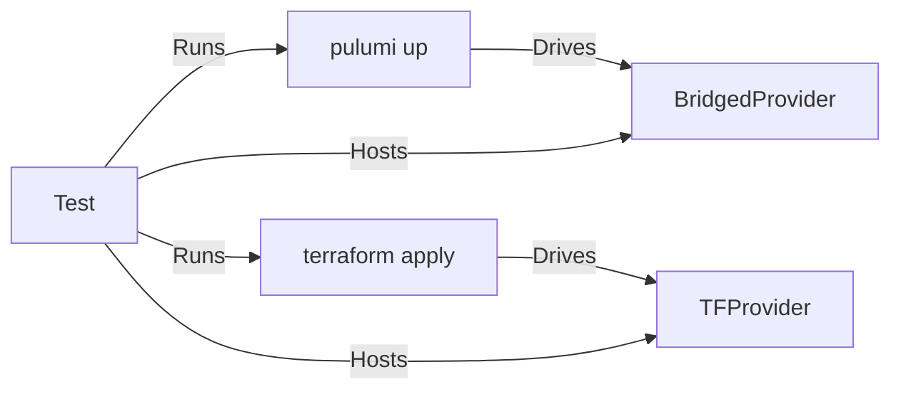

# cross-tests

This package provides cross-testing for [Terraform Plugin SDKv2](https://developer.hashicorp.com/terraform/plugin/sdkv2) based Terraform providers, bridged into
Pulumi with the Pulumi Terraform bridge. For PF based cross-tests, see [pf/.../cross-tests](../../../pf/tests/internal/cross-tests/README.md).

Cross tests compare and contrast the behavior of a given Terraform provider under Terraform CLI against the
behavior of the same provider bridged to Pulumi and used under Pulumi CLI. Cross-tests work by generating a
full in-memory Terraform provider and HCL program and running it with the Terraform CLI, then bridging the
Terraform provider (also in memory) and generating an equivalent Pulumi YAML program, and comparing the
result.

```
    +--------------------+                      +---------------------+
    | Terraform Provider |--------------------->| Operation(tfInputs) |
    +--------------------+                      +---------------------+
              |                                                        \
              |                                                         \
              |                                                          \
              |                                                      +---------------------+
              | shimv2.NewProvider                                   |  Witness Operation  |
              |                                                      +---------------------+
              |                                                          /
              |                                                         /
              V                                                        /
    +--------------------+                      +---------------------+
    |   Pulumi Provider  |--------------------->| Operation(puInputs) |
    +--------------------+                      +---------------------+
```

To make debugging easier, execution faster and avoid an extra build step, these tests start both Pulumi and Terraform
providers in-process and have the CLIs attach to these in-process providers:



The exact sequence of operations and asserts depends on the use case, for example cross-testing Diff convergence would
exercise state transition by imitating a change in resource inputs and comparing generated plans.

Currently, SDKv2 cross-testing supports:

- [Create](./create.go)
- [Configure](./configure.go)

Cross-tests can be written **either by** specify both the Terraform value *and* the Pulumi value **or** by
specifying *only* the Terraform value and specifying `crosstests.InferPulumiValue()` for the Pulumi value.

``` go
// A cross-test that infers the Pulumi value.
crosstests.Create(t,
	map[string]*schema.Schema{
		"f0": {	Optional: true, Type: schema.TypeBool },
	},
	cty.ObjectVal(map[string]cty.Value{
       	"f0": cty.BoolVal(true),
    }),
	crosstests.InferPulumiValue(),
)
```

``` go
// A cross-test that manually specifies the Pulumi value.
crosstests.Create(t,
	map[string]*schema.Schema{
		"f0": {	Optional: true, Type: schema.TypeBool },
	},
	cty.ObjectVal(map[string]cty.Value{
       	"f0": cty.BoolVal(true),
    }),
	resource.PropertyMap{
       	"f0": resource.NewProperty(true),
    },
)
```

Both traditional test cases and property-based test cases powered by rapid could be built on top of cross-test.

---

Initial cross tests were developed inside the cross-test folder against APIs internal to cross-tests. This was
vital to development of cross-tests. Currently we have multiple provider tests written in the cross-tests
folder. New tests should live next to the functionality that they are testing, and consume only the exported
API. As time permits, existing tests written using cross-tests against internal APIs will be moved outside of
the /cross-tests folder and written in terms of public cross-tests APIs.
