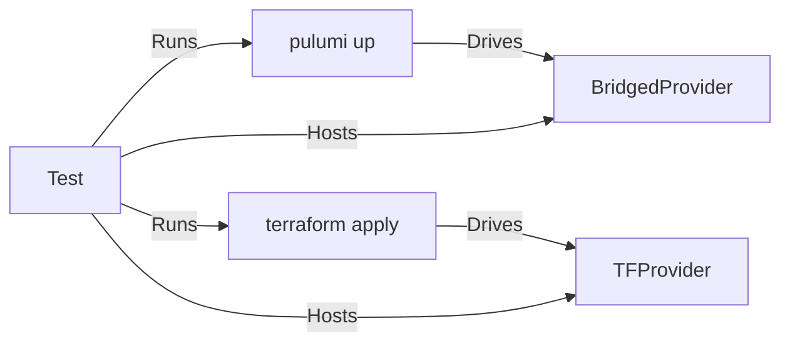

# cross-tests

Tests to compare and contrast the behavior of a given Terraform provider under Terraform CLI against the behavior of the
same provider bridged to Pulumi and used under Pulumi CLI.

To make debugging easier, execution faster and avoid an extra build step, these tests start both Pulumi and Terraform
providers in-process and have the CLIs attach to these in-process providers:

The exact sequence of operations and asserts depends on the use case, for example cross-testing Diff convergence would
exercise state transition by imitating a change in resource inputs and comparing generated plans.

Both traditional test cases and property-based test cases powered by rapid could be built on top of the same harness.

This is prototype-level code currently but expected to grow in importance over time as it can help quickly diagnose
bridged provider behavior discrepancies from the by-design behavior exhibited by Terraform, as well as proactively
locate gaps.
